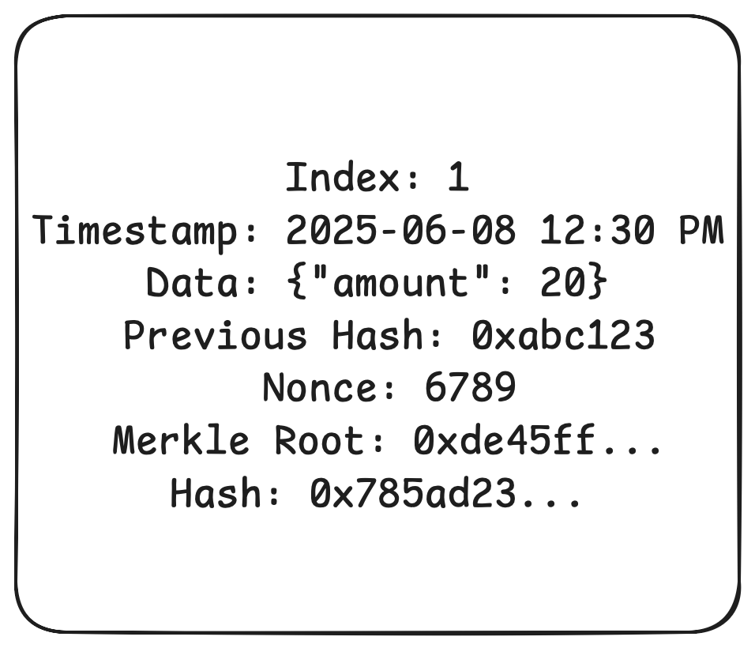

# MiniChainDemo
A lightweight Java-based simulation of blockchain fundamentals including block structure, mining (Proof of Work), and consensus mechanisms (PoW, PoS, DPoS).
## Theoretical Part: 
###Q-1.-> Blockchain Basics
**Define blockchain in your own words (100–150 words).**
**List 2 real-life use cases (e.g., supply chain, digital identity).**
**Answer:**
Blockchain is like a digital notebook where data is grouped into blocks and kept safe using special codes. Each block has a link to the one before it, like a chain. This way, once data is written down, it can’t be changed without changing all the blocks after it - which is super hard. Unlike regular databases, blockchain doesn’t have a boss in charge. Instead, it’s run by many people (called nodes), which makes it easy to see what’s going on and impossible to mess with. These features make it perfect for things that need to be secure and trustworthy, like cryptocurrencies, supply chains, and digital identities.

**Two Real-Life Use Cases**
1. **Supply Chain Transparency: Companies like Walmart use blockchain to track the journey of food products, improving safety by identifying contamination sources quickly.
2. **Digital Identity: Blockchain can provide secure, self-sovereign identity systems, reducing fraud and giving users full control over their data.

---

###Q-2.-> Block Anatomy
**Draw a block showing: data, previous hash, timestamp, nonce, and Merkle root.**
**Briefly explain with an example how the Merkle root helps verify data integrity.**
**Answer:**
This diagram shows the internal structure of a block in the chain:

**Each block contains:**
- Index
- Timestamp
- Data
- Previous Hash
- Nonce
- Merkle Root
**Merkle Root Explanation:**
The Merkle root is like a single fingerprint that summarizes all the transactions in a block. It’s made by repeatedly hashing pairs of transactions until there’s just            one hash left.
Let’s say you have transactions A, B, C, and D:
-Hash A and B → H1, C and D → H2
-Hash H1 and H2 → Merkle Root
Now, if someone tries to mess with transaction A, the Merkle root changes. This way, we can quickly spot any problems without having to check each transaction one by one.

---

###Q-3.->Consensus Conceptualization
**Explain in brief (4–5 sentences each):**
- What is Proof of Work and why does it require energy?
- What is Proof of Stake and how does it differ?
- What is Delegated Proof of Stake and how are validators selected?
**Answer:**
Consensus Conceptualization:-
**Proof of Work (PoW):**
PoW is a method where miners solve tricky puzzles to confirm transactions and add blocks. It uses a lot of electricity because miners use their computers to find a hash that meets a difficulty condition (like               starting with four zeros). It’s fair, but it’s expensive on the energy front.
**Proof of Stake (PoS):**
PoS chooses validators based on how much cryptocurrency they “stake” or lock up. The more you stake, the better your chances of validating the next block. It’s more energy-efficient than PoW because it doesn’t              require a lot of computing power.
**Delegated Proof of Stake (DPoS):**
DPoS works like a democratic election. Token holders vote to choose a small group of validators (delegates), who then take turns adding blocks. This makes transactions faster and more scalable, but it could become         too centralized if a few delegates get repeated votes.

---

